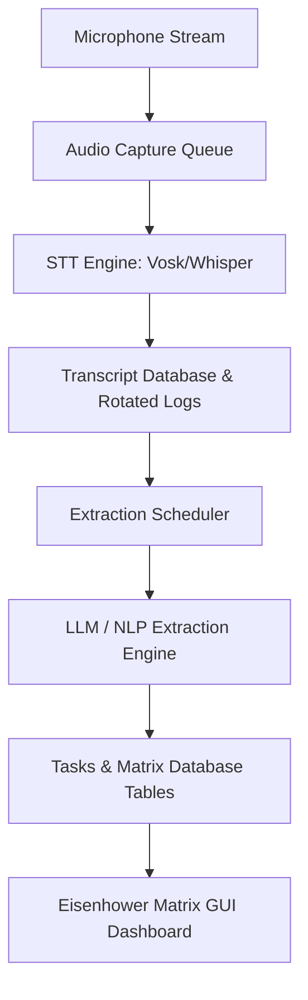

# Taskify Developer Guide

This guide describes the architecture, codebase organization, database schema, and test suites for developers contributing to Taskify.

---

## 1. Directory Structure & Architecture

Taskify's architecture is modular, separating audio capture, speech recognition, database storage, extraction scheduling, and the user interface.

```
src/taskify/
├── __init__.py
├── __main__.py          # Program execution launcher
├── cli/                 # Click command-line interface
├── audio/               # PyAudio / sounddevice capture streams
├── stt/                 # Vosk & Whisper speech transcription backends
├── storage/             # SQLite migrations and CRUD data access
├── llm/                 # Ollama and rule-based NLP extraction engines
├── pipeline/            # Background extraction worker scheduler
└── ui/                  # customtkinter graphical widgets
```

### Core Architecture Flowchart



---

## 2. Codebase Components

### 1. Configuration (`src/taskify/config/`)
- Uses `Settings` dataclasses mapped from default settings TOML and user-customizable overrides.

### 2. Audio Capture (`src/taskify/audio/`)
- Uses `sounddevice` to stream raw float32 array samples to a thread-safe Queue.
- Implements energy-based silence detection algorithms to pause downstream transcribing during quiet periods.

### 3. Speech-to-Text (`src/taskify/stt/`)
- Implements the `STTEngine` interface:
  - `VoskEngine`: Primary offline, light model.
  - `WhisperEngine`: Heavy model wrapper utilizing `faster-whisper`.
- Models are lazy loaded and resolved via the `get_stt_engine` factory.

### 4. Storage Engine (`src/taskify/storage/`)
- `DatabaseManager`: Exposes thread-safe connections using SQLite stdlib. Run database migration scripts sequentially from `storage/migrations/`.
- `TranscriptWriter`: Background worker flushing transcripts to SQLite and rotating logs at midnight.

### 5. Extraction Pipeline (`src/taskify/pipeline/`)
- `ExtractionScheduler`: Periodically triggers an extraction cycle in a daemon thread.
- `EventBus`: Decoupled publisher-subscriber hub matching pipeline updates to frontend dashboard refreshes.

---

## 3. SQLite Database Schema

Taskify uses four relational tables tracking capture sessions, segments, task lists, and categorization entries:

```sql
-- Schema version tracking
CREATE TABLE schema_migrations (
    version INTEGER PRIMARY KEY,
    applied_at TIMESTAMP DEFAULT CURRENT_TIMESTAMP
);

-- Voice capture sessions
CREATE TABLE sessions (
    id TEXT PRIMARY KEY,
    start_time REAL NOT NULL,
    end_time REAL,
    created_at TIMESTAMP DEFAULT CURRENT_TIMESTAMP
);

-- Transcribed audio segment lines
CREATE TABLE transcripts (
    id INTEGER PRIMARY KEY AUTOINCREMENT,
    session_id TEXT REFERENCES sessions(id) ON DELETE CASCADE,
    text TEXT NOT NULL,
    confidence REAL NOT NULL,
    start_time REAL NOT NULL,
    end_time REAL NOT NULL,
    processed INTEGER DEFAULT 0 CHECK(processed IN (0, 1)),
    created_at TIMESTAMP DEFAULT CURRENT_TIMESTAMP
);

-- Extracted tasks
CREATE TABLE tasks (
    id INTEGER PRIMARY KEY AUTOINCREMENT,
    title TEXT NOT NULL,
    notes TEXT,
    due_date TEXT,
    completed INTEGER DEFAULT 0 CHECK(completed IN (0, 1)),
    user_override INTEGER DEFAULT 0 CHECK(user_override IN (0, 1)),
    created_at TIMESTAMP DEFAULT CURRENT_TIMESTAMP,
    updated_at TIMESTAMP DEFAULT CURRENT_TIMESTAMP
);

-- Eisenhower matrix quadrant entries
CREATE TABLE matrix_entries (
    task_id INTEGER PRIMARY KEY REFERENCES tasks(id) ON DELETE CASCADE,
    quadrant TEXT CHECK(quadrant IN ('urgent_important', 'important_not_urgent', 'urgent_not_important', 'neither')),
    created_at TIMESTAMP DEFAULT CURRENT_TIMESTAMP,
    updated_at TIMESTAMP DEFAULT CURRENT_TIMESTAMP
);
```

---

## 4. Development Setup & Tests

### Installation
1. Clone the repository and establish a Python virtual environment:
   ```bash
   python -m venv .venv
   .venv\Scripts\activate  # Windows
   source .venv/bin/activate  # macOS/Linux
   ```
2. Install with all development extras:
   ```bash
   pip install -e .[dev,nlp,whisper]
   ```

### Makefile Shortcuts
Taskify includes automated quality checks and builders.

| Action | Makefile Target | CLI Alternative |
|---|---|---|
| Run Complete Test Suite | `make test` | `pytest tests/ -v` |
| Code Lint Check | `make lint` | `ruff check src/` |
| Type-Checking | `make typecheck` | `mypy src/` |
| Package Executable | `make dist` | `python packaging/build.py` |
